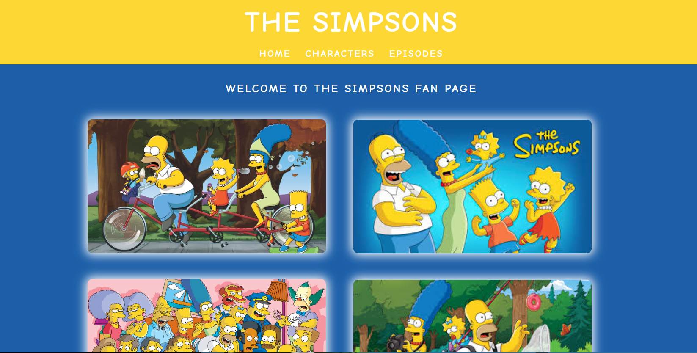

<h1 align="center"> The Simpsons - Fan Page </h1>

Este projeto foi em uma serie de projetos do mês de Julho para prática e aperfeiçoamento do Javascript, onde criei uma página dedicada a série The Simpsons.

  

 

# 🔨 Funcionalidades do projeto

`Funcionalidade 1`: Utilização de hiperlinks na página de Characters e Episodes. 
`Funcionalidade 2`: Utilização do picture and picture. 

 

# 🚀 Tecnologias

As seguintes ferramentas foram usadas na construção do projeto:

- HTML
- CSS
- JavaScripts

 

# 💻 Você pode acessar [aqui]()
